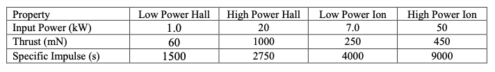

# EP_Spiral_Transfers
This project models the spiral transfer trajectories of different electric propulsion thrusters. This is done as part of my final project for my ASTE 404 course at USC.

## Implementation Instructions
*The implementation example shown below is for a high power ion thruster.*
### 1. Building the simulation
Make a directory for the project containing the trajectory.cpp and plotter.py files.

To build the simulation, first pick a thruster to simulate from the options below, and replace lines 45 and 46 in trajectory.cpp with the values for thrust and Isp desired.



Make sure to also give the .csv file a name specfic to the thruster chosen. (Eg. thruster_HPI.csv).

The updated lines in the simulation code should look like this:
```cpp
// LINE 45
double T = 450e-6; // thrust in kN = kg*km/s^2, replace value for current property
// LINE 46
double Isp = 9000; // specific impulse in s, replace value for current property

// LINE 109
std::ofstream out("trajectory_HPI.csv");
```

### 2. Compiling and Running the Simulation
To compile the trajectory.cpp file paste the following command into the command line in the same folder where your file is located. Make sure to have an output file named specifically to the thruster chosen. For example:
```bash
g++ trajectory.cpp -o trajectory_HPI
```
Now, to run the simulation paste the command below into the terminal.
```bash
./trajectory_HPI
```

### 3. Setting up the plotter
Now open the plotter.py file and replace the .csv filename with the filename for the thruster. For example:
```python
# LINE 8
data = np.loadtxt("trajectory_HPI.csv", delimiter=",", skiprows=1)
```

### 4. If using the Low Power Hall Thruster (skip this step if not)
*For our high power ion thruster example, skip this step.*

The Low Power Hall Thruster takes much longer than the others to reach Mars so make sure to increase the frames and decrease the time steps so that frames per ms is larger. Replace the following lines in plotter.py with what is shown below.
```python
# ONLY FOR LPH
# LINE 89
frames = range(0, len(x), 50000)

# LINE 97
interval=2,   # ms per frame
```
This is 100 times larger frames / ms than for the other thrusters:
```python
# ONLY FOR HPH, LPI, HPI
# LINE 89
frames = range(0, len(x), 5000)

# LINE 97
interval=20,   # ms per frame
```

### 5. Running the plotter
Now that the plotting file is all set, run it via the command line by pasting the command below. Make sure that the virtual environment is activated or necessary packages are installed for numpy and matplotlib.
```bash
python3 plotter.py
```

### 6. Want to save a video of the simulation?
If a .mp4 video of the spiral trajectory simulation is desired, uncomment the line below in plotter.py and give it the unique name for the thruster.
```python
# LINE 105
# To save as a video (optional, needs ffmpeg installed):
anim.save("earth_to_mars_trajectory_HPI.mp4", fps=30, dpi=150)
```